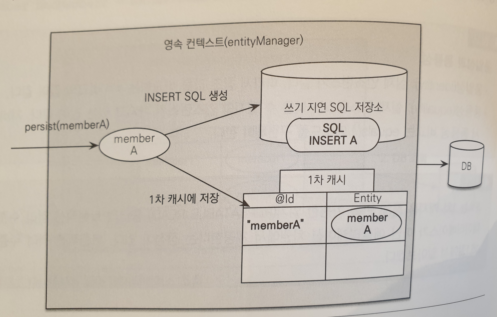

# 3장 영속성 관리

# 3.1 엔티티 매니저 팩토리와 엔티티 매니저

## Entity manager factory

```java
EntityManagerFactory emf = Persistence.createEntityManagerFactory("jpabook");
```

- 데이터베이스를 하나만 사용하는 애플리케이션은 일반적으로 엔티티 매니저 팩토리를 하나만 생성해서 애플리케이션 전체에서 공유.
- 엔티티 매니저 팩토리가 생성될 때 커넥션풀도 만들어진다.
- 스레드 세이프하다.

## Entity manager

```java
EntityManager em = emf.createEntityManager();
```

- 엔티티 매니저 팩토리를 이용해서 엔티티 매니저 생성
- 엔티티 매니저는 스레드 세이프하지 않다.
- 요청 마다 엔티티 매니저를 생성해 사용한다.
- 엔티티 매니저는 트랜잭션을 시작할 때 커넥션을 획득해 사용한다.

트랜잭션을 시작할 때는 언제이지?
@Transactional 애노테이션이 붙은 메서드를 만날 때인가.
NONO.

EntityManager em = emf.createEntityManager();
EntityTransaction transaction = em.getTransaction();
transaction.begin();
이 때 트랜잭션을 시작한다.

# 3.2 영속성 컨텍스트

```java
em.persister(member);
```

- 엔티티를 영구 저장하는 환경
- 엔티티 매니저가 만들어질 때 영속성 컨텍스트도 하나 만들어진다.
- 엔티티 매니저를 사용해서 영속성 컨텍스트를 관리한다.
- 여러 엔티티 매니저가 하나의 영속성 컨텍스트에 접근할 수 있다.(11장)

# 3.3 엔티티의 생명주기

- 비영속 : 영속성 컨텍스트와 전혀 관계가 없는 상태
- 영속 : 영속성 컨텍스트에 저장된 상태
- 준영속 : 영속성 컨텍스트에 저장되었다가 분리된 상태
- 삭제 : 삭제된 상태

```java
Member member = new Member("이름", 20); // 비영속상태

em.persist(member); // 영속상태

em.detach(member); // 준영속상태

em.remove(member); // 삭제 상태. 영속성컨텍스트 및 DB에서 삭제.
```

# 3.4 영속성 컨텍스트의 특징

### 영속성 컨텍스트와 식별자 값

영속성 컨텍스트는 엔티티를 식별자 값(id)로 구분하기 떄문에 영속 상태는 식별자 값이 반드시 있어야 한다. 

### 영속성 컨텍스트와 데이터베이스 저장

트랜잭션을 커밋하는 순간에 영속성 컨텍스트에 있는 엔티티가 데이터베이스에 저장된다. (flush 할 때)

### 엔티티 컨텍스트의 장점

- 1차 캐시
    - (flush 전에는 db가 아닌 영속성 컨텍스트에서 값을 조회한다)
- 동일성 보장
- 트랜잭션을 지원하는 쓰기 지연
- 변경 감지
    - 더티 체킹으로 변경을 감지해 update 함
- 지연 로딩
    - fetch lazy.

## 3.4.1 엔티티 조회

```java
Member member = new Member();
member.setId(1);
member.setName("sloth");

Member find = em.find(Member.class, 1);
String name = find.getName(); // sloth
```

영속성 컨텍스는 내부에 캐시를 가지고 있는데 이를 `1차 캐시`라고 한다. 

영속성 컨텍스트에 @Id를 key로 entity를 value로 하는 Map이 하나 있다.

key는 데이터베이스의 기본키(pk)와 매핑되어 있다.

em.find()를 호출하면 1차 캐시에서 먼저 조회하고 없으면 데이터베이스에서 찾아서 1차 캐시에 저장하고 반환한다.

### 영속 엔티티의 동일성 보장

```java
Member a = em.find(Member.class "member1");
Member b = em.find(Member.class "member1");

a == b // true
```

### 동일성과 동등성

- 동일성 : 실제 같은 인스턴스. `==`으로 비교.
- 동등성 : 실제 인스턴스는 다를 수 있지만 가지고 있는 값이 같음. `equals`로 비교.

## 3.4.2 엔티티 등록

```java
EntityManager em = emf.createEntityManager();
EntityTransaction transaction = em.getTransaction();
transaction.begin();

em.persist(memberA); // 아직 데이터베이스에 저장 안 됨. 영속성 컨텍스트에만 등록.

transaction.commit(): // 데이터베이스에 insert query를 날림.
```

- 엔티티 매니저는 트랜잭션을 커밋하기 전까지 데이터베이스에 엔티티를 저장하지 않고 내부 쿼리 저장소에 INSERT SQL을 모아둔다.
- 트랜잭션을 커밋할 때 모아둔 쿼리를 데이터베이스에 보냄. (쓰기 지연 transactional write-behind)
- 트랜잭션 커밋 → 영속성 컨텍스트 flush → SQL 저장소의 쿼리를 데이터베이스로 보냄 → 실제 데이터베이스 커밋
- 데이터베이스를 커밋하기 전에만 SQL 쿼리를 데이터베이스에 보내면 되기 때문에 save가 일어날 때마다 데이터베이스에 쿼리를 보내는 것과 SQL 쿼리를 모아두었다가 한 번에 보내는 것과 차이가 없다.



## 3.4.3 엔티티 수정

### 변경 감지(Dirty checking)

```java
Member saveMember = new Member("member1", "sloth");
em.persist(saveMember);
em.flush();

Member memberA = em.find(Member.class, "member1");
memberA.setName("슬로스");

transaction.commit(); 
//em.update(memberA); 이런 거 필요 없음.
```

- JPA로 엔티티를 수정할 때는 엔티티를 조회해서 데이터만 변경하면 된다.
- JPA는 엔티티를 영속성 컨텍스트에 보관할 때, 최초 상태를 복사해서 스냅샷을 저장해둠.
- 플러시 시점에 스냅샷과 엔티티를 비교해서 변경을 감지해 반영한다.
- update query는 변경된 값만 반영하는 게 아니라 모든 필드를 업데이트한다.
    - @DynamicUpdate 혹은 @DynamicInsert와 같은 어노테이션을 이용해서 변경된 값만, null을 제외하고 insert하는 값만 반영하는 sql 쿼리를 동적으로 생성할 수도 있지만, 컬럼이 30개 이상인 경우에만 그리고 최적화의 필요성을 느낄 때만 사용하는 것을 추천.
    - 그러나, 컬럼이 30개 이상이면 테이블 설계가 잘못된 것일 수 있음.
    - 테이블 설계를 잘하고, 기본 전략을 사용하기로 하자.

## 3.4.4 엔티티 삭제

```java
Member memberA = em.find("member1");
em.remove(memberA);
```

- 삭제 대상인 엔티티를 조회하고 `em.remove();`

# 3.5 플러시

플러시(flus())는 영속성 컨텍스트의 변경 내용을 데이터베이스에 반영한다. 

다음의 세 가지 방법으로 플러시를 할 수 있다.

- em.flush() (거의 사용 안 함)
- transaction.commit();
- JPQL 쿼리 실행

    JPQL 쿼리는 SQL로 변환되어 데이터베이스에서 엔티티를 조회하기 때문에 flush를 하지 않으면 memberA, memberB, memberC를 가져오지 못한다. 그래서 flush하고 조회해옴.

    find()는 영속성 컨텍스트에서 값을 찾기 때문에 flush하지 않아도 됨.

    ```java
    em.persist(memberA);
    em.persist(memberB);
    em.persist(memberC);

    query = em.createQuery("select m from Member m", Member.class); // flush실행됨
    List<Member> members = query.getResultList();
    ```

### 플러시를 실행하면 일어나는 일

- 모든 엔티티를 스냅샷과 비교해서 변경 감지를 함.
- 수정된 엔티티는 수정 쿼리를 만들어 SQL 저장소에 등록함.
- 쓰기 지연 SQL 저장소의 쿼리를 데이터베이스에 전송함.

## 3.5.1 플러시 모드 옵션

```java
em.setFlushMode(FlushModeType.COMMIT);
```

- [FlushModeType.AUTO](http://flushmodetype.AUTO) : 커밋이나 쿼리를 실행할 때 플러시(기본값)
- FlushModeType.COMMIT : 커밋할 때만 플러시
    - 성능 최적화할 때 사용함(10.6절)

# 3.6 준영속

영속성 컨텍스트가 관리하는 영속 상태의 엔티티가 영속성 컨텍스트에서 분리된(detached) 것을 준영속 상태라 한다.

준영속 상태에서는 엔티티 매니저가 제공하는 기능을 사용할 수 없다. 

- em.detach(entity) : 특정 엔티티만 준영속 상태로 변경
- em.clear() : 영속성 컨텍스트 초기화
- em.close() : 영속성 컨텍스트 종료

### 준영속 상태와 비영속 상태의 차이는?

- 준영속 상태의 엔티티는 한 번 영속 상태였기 때문에 Id를 가지고 있다. 비영속 상태는 안 가지고 있음.

## 3.6.5 병합 : merge()

준영속 상태의 엔티티를 다시 영속 상태로 변경

병합은 파라미터로 넘어온 엔티티의 식별자 값으로 영속성 컨텍스트를 조회하고 찾는 값이 없으면 데이터베이스에서 조회한다.

데이터베이스에도 값이 없으면 새로운 엔티티를 생성해서 병합함.

save, update 모두 수행함.

db 혹은 영속성 컨텍스트에 있으면 변경 감지를 통해 update를 하고 값이 없으면 save를 한다.